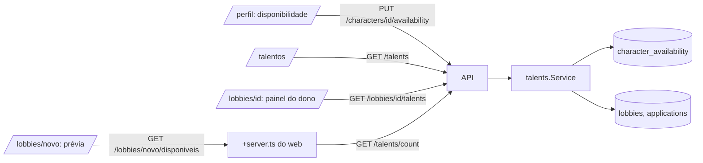

# Design — Banco de talentos

- Spec: `./spec.md` · Status: Aprovado (2026-10-09)

## 1. Visão geral
A disponibilidade é uma tabela nova, 1:1 com o personagem. A API ganha um pacote
`talents`, que grava a disponibilidade e responde às três leituras da spec: o catálogo, a
afinidade de um lobby e a contagem da criação. As três usam a mesma consulta de
afinidade. O web ganha uma seção no perfil, um painel do dono no detalhe do lobby, a
contagem na prévia da criação e a página `/talentos`.

## 2. Análise de reuso
| Existente | Onde | Uso nesta feature |
|---|---|---|
| Janela de 2 h (D-03 da `lobbies`) | `lobbies.go`, `HasScheduleConflict` | Mesma janela para "livre no horário" (RN-06.5). A query nova também conta as candidaturas pendentes, que a de conflito não conta |
| Catálogo de instâncias | `internal/catalog` | Valida `instanceIds` e filtra as que saíram do catálogo (RN-04) |
| `mustLoad("America/Sao_Paulo")` e `time/tzdata` | `lobbies.go` (D-04 da `lobbies`) | Converte o início do lobby para dia e minuto de Brasília |
| Erros por campo (D-07 da `lobbies`) | `ValidationError`, `FieldError`, `messages.ts` | Erros 422 da disponibilidade |
| `GetOwnCharacter`, `LockUser` | `queries/characters.sql` | Dono do personagem (RN-05) e trava contra exclusão simultânea |
| Sessão opcional nas rotas públicas | `session.currentUser` | `/talents` mostra o `@username` só com sessão (RNF-05) |
| Retrato, classe e função | `Icon`, `ROLE_LABELS`, `/portraits` | Cards do catálogo e do painel |
| `FilterPanel` da Home | `web/src/lib/home/components` | Padrão visual dos filtros de `/talentos` (componente novo, mesmo estilo) |

Não reuso o `HasScheduleConflict` direto. Ele recebe um personagem por vez e não olha as
pendentes. A afinidade precisa filtrar muitos personagens numa consulta só.

## 3. Componentes e interfaces

### `talents.Service` (Go, pacote novo `internal/talents`)
- `SetAvailability(ctx, userID, characterID, in AvailabilityInput) (Availability, error)`:
  valida as RN-02 a RN-04, confere o dono (RN-05) e grava por upsert. RN-01, RN-05.
- `Catalog(ctx, filter CatalogFilter, withDiscord bool) ([]Talent, error)`. RN-11, RN-12.
- `ForLobby(ctx, userID, lobbyID) ([]Talent, error)`: só o dono, só lobby aberto.
  RN-06 a RN-09.
- `Count(ctx, userID, probe Probe) (int, error)`: o lobby ainda não existe, então `Probe`
  traz instância, início, nível mínimo, vagas abertas e o personagem do dono. RN-10.
- `ForLobby` e `Count` montam um `Probe` e chamam a mesma consulta `Affinity`.

### Consulta de afinidade (sqlc, `queries/talents.sql`)
Entrada: `instance_id`, `dow` e `minute` (Brasília), `min_level`, `roles` (funções com
vaga aberta), `window_start` e `window_end` (início ± 2 h), `exclude_user_id` (o dono) e
`lobby_id` (opcional).
- Condição 1: `any_instance OR @instance_id = ANY(instance_ids)`.
- Condição 2 (RN-03):
  - faixa sem virada (`start_minute < end_minute`): o dia está nos dias e
    `start_minute <= @minute < end_minute`;
  - faixa que vira: o dia está nos dias e `@minute >= start_minute`, ou o dia anterior
    está nos dias e `@minute < end_minute`.
- Condições 3 e 4: `level >= @min_level AND role = ANY(@roles)`.
- Condição 5: `NOT EXISTS` de um lobby não cancelado com início na janela em que o
  personagem é dono ou tem candidatura pendente ou aceita. Inclui o próprio lobby, que
  está na janela.
- RN-07: `c.user_id <> @exclude_user_id`.
- Ordem (RN-08): `level DESC, lower(nick)`.

### Endpoints / contratos (`openapi.yaml`)
| Método | Rota | Entrada | Saída | Erros | IDs |
|---|---|---|---|---|---|
| PUT | `/characters/{id}/availability` | `AvailabilityInput` | 200 `Availability` | 401, 404, 422 | US-01, RN-01..05 |
| GET | `/talents` | `instanceId?`, `role?`, `day?` (0–6), `time?` (HH:MM) | 200 `Talent[]` | 422 | US-04, RN-11, RN-12 |
| GET | `/lobbies/{id}/talents` | — | 200 `Talent[]` | 401, 404 (não é o dono), 409 `lobby_not_open` | US-02, RN-06..09 |
| GET | `/talents/count` | `instanceId`, `startsAt`, `minLevel`, `tank`, `support`, `dps`, `characterId` | 200 `{ count }` | 401, 422 | US-03, RN-10 |

- `AvailabilityInput`: `enabled`, `days` (inteiros 0–6, domingo = 0), `start` e `end`
  (`"HH:MM"`), `anyInstance` e `instanceIds`. Com `enabled: false`, o resto é opcional e
  os dados guardados continuam como estão (RN-01).
- `Availability`: os mesmos campos. `Character` ganha `availability` (nullable), para o
  perfil abrir o formulário preenchido (CA-01.4).
- `Talent`: `characterId`, `nick`, `classId`, `level`, `role`, `portrait`, `link`,
  `days`, `start`, `end`, `anyInstance`, `instances` (`{id, name}`) e `discordUsername`.
  O `discordUsername` só vem com sessão; sem ela, o campo é omitido (RNF-05).

### Web
- **Perfil:** cada card de personagem ganha "Banco de talentos" (ligado ou desligado).
  Abre um diálogo com o interruptor, os dias (chips), início e fim (selects de 30 em
  30 min) e as instâncias ("Qualquer instância" ou uma lista de checkboxes agrupada como
  na criação). Action `?/availability`. US-01.
- **Detalhe do lobby:** um painel "Jogadores disponíveis", só para o dono com o lobby
  aberto, abaixo dos pendentes. O `load` busca `/lobbies/{id}/talents` quando `isOwner`.
  US-02.
- **Criação:** a prévia ganha "N jogadores disponíveis". O formulário chama
  `GET /lobbies/novo/disponiveis` (um `+server.ts` que repassa a sessão para
  `/talents/count`) com espera de 300 ms entre mudanças. Se a chamada falhar, a linha
  some. US-03.
- **`/talentos`:** página pública, com SSR e filtros na query string (GET, funciona sem
  JS). Link "Banco de talentos" na TopBar. US-04.

## 4. Modelo de dados
| Entidade | Campo | Tipo | Restrições | Garante |
|---|---|---|---|---|
| `character_availability` | `character_id` | uuid | PK, FK `characters(id)` ON DELETE CASCADE | RN-01, RN-05 |
| | `enabled` | boolean | NOT NULL | RN-01 |
| | `days` | smallint | NOT NULL, CHECK 1..127 (bit `d` = dia `d`, domingo = 0) | RN-02 |
| | `start_minute` | smallint | NOT NULL, CHECK 0..1410 e `% 30 = 0` | RN-03 |
| | `end_minute` | smallint | NOT NULL, CHECK 0..1410, `% 30 = 0` e `<> start_minute` | RN-03 |
| | `any_instance` | boolean | NOT NULL | RN-04 |
| | `instance_ids` | text[] | NOT NULL, CHECK `any_instance OR cardinality > 0` | RN-04 |
| | `updated_at` | timestamptz | NOT NULL | — |

Índice parcial: `(character_id) WHERE enabled`. O banco começa pequeno, e a consulta
junta com `characters`.

Migração: `00007_character_availability.sql`.

## 5. Decisões técnicas (ADR)

### D-01 — Horário de parede de Brasília, não UTC
- Status: Aceita
- Contexto: o CLAUDE.md pede datas em UTC no banco. A faixa da disponibilidade não é um
  instante: é "toda sexta das 22:00 às 02:00", que se repete. [RN-03, RNF-01]
- Opções:
  - (a) converter para UTC: a faixa muda de dia e quebra a leitura dos dados;
  - (b) dia da semana e minutos em Brasília.
- Decisão: (b). O início do lobby (UTC) vira dia e minuto de Brasília em Go, com
  `America/Sao_Paulo`, antes da consulta.
- Consequências:
  - \+ o dado é o que o jogador digitou, e a regra da meia-noite fica explícita;
  - − se o Brasil voltar a ter horário de verão, a conversão continua certa, porque usa o
    fuso e não um deslocamento fixo. Uma faixa que cair na hora pulada só fica mais
    curta naquele dia.

### D-02 — Tabela 1:1 em vez de colunas em `characters`
- Status: Aceita
- Contexto: a disponibilidade é opcional e tem o próprio ciclo de vida. [RN-01]
- Opções: (a) colunas nulas em `characters`; (b) tabela própria.
- Decisão: (b). Personagem sem linha nunca entrou no banco. `enabled = false` saiu e
  guardou os dados.
- Consequências: + `characters` e as regras dela não mudam; − um JOIN a mais no perfil.

### D-03 — Dias como bitmask e instâncias como `text[]`
- Status: Aceita
- Contexto: são até 7 dias e poucas instâncias por personagem, e o catálogo vive em Go
  (D-02 da `lobbies`). [RN-02, RN-04]
- Opções: tabelas filhas, ou bitmask e array.
- Decisão: `days` como bitmask (`days & (1 << dow) <> 0`) e `instance_ids text[]`. Os ids
  que saíram do catálogo são filtrados na leitura, em Go.
- Consequências: + uma linha por personagem e consulta simples; − sem FK nas instâncias,
  o que já é o padrão do projeto.

### D-04 — Uma consulta de afinidade para lobby e criação
- Status: Aceita
- Contexto: as RN-09 e RN-10 aplicam a mesma RN-06, uma com o lobby gravado e outra com o
  formulário. [RN-06, RN-09, RN-10]
- Decisão: o serviço monta um `Probe` (instância, dia e minuto, nível, funções com vaga,
  janela, dono e lobby opcional). No lobby gravado, as funções com vaga saem de
  `slots - occupied`. Na criação, saem das vagas do formulário menos a vaga do personagem
  do dono.
- Consequências: + um ponto de verdade e testes concentrados na consulta; − a contagem
  da criação leva todos os campos do formulário na query string.

### D-05 — `@username` só com sessão, decidido na API
- Status: Aceita
- Contexto: RN-12 e RNF-05. O web poderia esconder o nome, mas ele ainda iria no JSON e
  no HTML.
- Decisão: o handler de `GET /talents` lê a sessão de forma opcional e só preenche
  `discordUsername` quando ela existe. `/lobbies/{id}/talents` exige sessão (é do dono).
- Consequências: + o nome nunca sai sem sessão; − a resposta de `/talents` varia com a
  sessão. O web não guarda essa resposta em cache.

### D-06 — Erros por campo e mensagens
- Status: Aceita
- Decisão: mesmo formato da D-07 da `lobbies`. Mensagens novas:
  - `days/required` → "Escolha pelo menos um dia";
  - `start/invalid` e `end/invalid` → "Escolha um horário de 30 em 30 minutos";
  - `end/same_as_start` → "O fim precisa ser diferente do início";
  - `instanceIds/required` → "Escolha uma instância ou marque Qualquer instância";
  - `instanceIds/invalid` → "Escolha instâncias da lista".

## 6. Riscos
| Risco | Impacto | Mitigação |
|---|---|---|
| Catálogo grande sem paginação | `/talentos` lenta com muitos personagens | Limite de 100 por resposta, ordenado (RN-08), e aviso "Mostrando os 100 primeiros; use os filtros". Paginação entra se o banco crescer |
| Contagem da criação a cada tecla | Muitas chamadas | Espera de 300 ms e só com instância, dia e hora válidos |
| Nomes do Discord raspados | Privacidade | D-05; o catálogo público mostra só os dados do jogo |
| Regra da meia-noite mal entendida | Afinidade errada | Testes de borda: faixa 22:00–02:00, fim excluído e virada de sábado para domingo |
