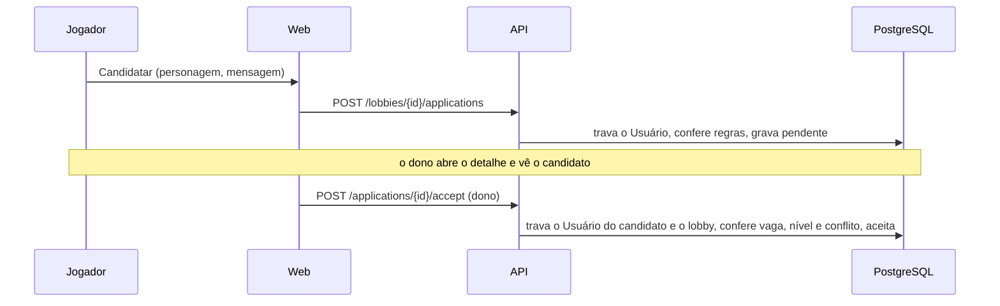

# Design — Candidatura a lobby (Parte 1)

- Spec: `./spec.md` (revisão de 2026-10-06) · Status: Aprovado
- Tela: Claude Design, `Candidatura.dc.html` (1a a 1f)
- Escopo: US-01 a US-04, US-10, RN-25, RN-26, RN-30 a RN-34. A Parte 2 (US-05 a US-08)
  fica fora, mas o modelo de dados já comporta os estados dela.

## 1. Visão geral
A API ganha a candidatura (tabela, serviço e rotas) e passa a contar os membros aceitos
nas vagas do lobby. O detalhe do lobby passa a depender de quem olha: dono, membro,
candidato ou visitante veem coisas diferentes (RN-28, RN-29, RN-32). O web ganha o
diálogo de candidatura, a lista de pendentes do dono, o painel de detalhes do jogador e
a página "Minhas candidaturas".

## 2. Análise de reuso
| Existente | Onde | Uso |
|---|---|---|
| `LockUser`, `inTx`, `ValidationError` | `internal/lobbies`, `internal/characters` | Mesmo padrão de transação e erro por campo |
| `HasScheduleConflict` (janela de 2 h) | `queries/lobbies.sql` | Passa a olhar também as vagas de membro (D-04) |
| `occupied` do lobby | `internal/lobbies` | Passa a somar os membros aceitos (D-03) |
| `CharacterOwnsOpenLobby` e `ErrInOpenLobby` | `internal/characters` | Vira "personagem em grupo aberto", com nível e candidaturas (RN-25, RN-26) |
| `CancelDialog` (motivo 10 a 250) | `lib/lobbies/components` | Base do diálogo de recusa |
| `CharacterCard`/retratos, `LobbyCard` | `lib/characters`, `lib/home` | Painel do jogador e selo de pendentes |
| Discord falso com várias contas, `seed.ts` | `web/test/e2e` | Dono, candidato e visitante no ponta a ponta |

## 3. Componentes e interfaces

### Backend
- **`internal/applications`**: `Apply`, `Accept`, `Reject`, `Withdraw`, `ListMine`.
  Valida as RN-01 a RN-13 e a RN-30, com trava (D-05). Erros de domínio por código:
  `not_open`, `own_lobby`, `already_active`, `role_full`, `rejected_before`,
  `below_min_level`, `schedule_conflict`, `not_pending`, `not_owner`, `not_yours`.
- **`internal/lobbies`**: `Get` recebe quem olha (`viewerID`, pode ser vazio) e devolve
  membros, pendentes e a candidatura de quem olha, conforme a visibilidade (D-06). O
  `Cancel` expira as pendências na mesma transação (RN-16). A edição confere as vagas
  contra dono e membros (RN-18 da `lobbies`).
- **`internal/characters`**: a trava passa a valer para nível, e para personagem com
  candidatura pendente ou aceita em lobby aberto (RN-25, RN-26).

### Endpoints
| Método | Rota | Quem | Saída | Erros |
|---|---|---|---|---|
| GET | `/lobbies/{id}` | todos (sessão opcional) | `Lobby` com `members`, `pendingCount`, `pending` (só dono), `myApplication` | 404 |
| POST | `/lobbies/{id}/applications` | sessão | 201 `Application` | 401, 404, 409 `{error, code}`, 422 (mensagem, personagem) |
| POST | `/applications/{id}/accept` | dono | 200 `Application` | 401, 404, 409 |
| POST | `/applications/{id}/reject` | dono | 200 `Application` | 401, 404, 409, 422 (justificativa) |
| POST | `/applications/{id}/withdraw` | candidato | 200 `Application` | 401, 404, 409 |
| GET | `/me/applications` | sessão | 200 `MyApplication[]` | 401 |

`GET /lobbies` (Home) passa a trazer `pendingCount`, que é público (RN-28); o selo
"N pendentes" aparece só para o dono (RN-34, decidido no web). Uma candidatura de
outro lobby ou de outra pessoa responde 404 (como a RN-02 da `personagens`).

### Web
- **Detalhe do lobby**: estado "pessoa selecionada" (começa no anfitrião). Cards da
  composição e dos pendentes são botões que trocam o painel (RN-31). Componentes:
  `PlayerPanel` (retrato, nick, classe, nível, função, link, Discord quando permitido,
  mensagem e Aceitar/Recusar para o dono), `ApplyDialog` (personagens com o motivo de
  quem não pode, mensagem) e `RejectDialog`. Actions: `apply`, `accept`, `reject`,
  `withdraw`, além do `cancel` que já existe.
- **`/candidaturas`**: "Minhas candidaturas" com retirar (RN-33); item no menu do usuário.
- **Home**: selo "N pendentes" no card quando `owner.userId` é o Usuário logado (RN-34).
- **Perfil**: mensagem nova da trava (nível e função), RN-25.

## 4. Modelo de dados
Migração `00005_applications.sql`:

**`applications`**
| Campo | Tipo | Regra |
|---|---|---|
| id | uuid PK | — |
| lobby_id | uuid FK `lobbies` `ON DELETE CASCADE` | — |
| user_id | uuid FK `users` `ON DELETE CASCADE` | RN-01, RN-02 |
| character_id | uuid FK `characters` `ON DELETE SET NULL` | RN-26 (só depois do lobby) |
| role | text (`tank/support/dps`) | RN-04, cópia da função na candidatura |
| message | text null, `<= 250` | RN-06 |
| status | text: `pending`, `accepted`, `rejected`, `withdrawn`, `expired` (e os da Parte 2) | RN-17 |
| reason | text null, `10..250` | RN-09, só na recusa |
| created_at, decided_at | timestamptz | RN-18 |

Índice único parcial `(lobby_id, user_id) WHERE status IN ('pending','accepted')` (RN-02).

**`application_events`** (histórico, RN-18): `application_id`, `from_status`,
`to_status`, `actor_id` (nulo quando é o sistema), `reason`, `at`.

## 5. Decisões técnicas (ADR)

### D-01 — Uma tabela de candidaturas com o estado em texto, e histórico à parte
- Contexto: RN-17 e RN-18; a Parte 2 traz `left`, `removed` e `cancelled`.
- Decisão: `applications.status` com `CHECK` dos estados e `application_events` para o
  histórico. Cada transição grava a linha e o evento na mesma transação.

### D-02 — Expiração pelo horário, sem job
- Contexto: RN-16; o lobby fica "iniciado" pelo horário (RN-13 da `lobbies`), sem job.
- Decisão: candidatura `pending` de lobby iniciado é lida como `expired` (consulta e
  serviço usam o mesmo "efetivo"). No cancelamento, o serviço grava `expired` nas
  pendentes, com evento, na mesma transação.
- Consequência: a expiração pelo início não gera evento no histórico; o critério da
  CA-03.6 vale para criação, decisão e retirada.

### D-03 — Ocupantes = dono + aceitos
- Decisão: `occupied` de cada função = 1 se for a função do dono + candidaturas
  `accepted` daquela função. As consultas de lobby passam a trazer essas contagens e o
  `pendingCount`.

### D-04 — Conflito de horário olha dono e membro
- Decisão: `HasScheduleConflict` passa a considerar o personagem como dono de lobby não
  cancelado **ou** aceito em lobby não cancelado, na mesma janela de 2 h. Vale para criar
  lobby e para aceitar candidatura.

### D-05 — Travas para vagas e conflito
- Candidatar trava o Usuário do candidato (RN-02 sob concorrência).
- Aceitar trava, nesta ordem, o Usuário do candidato e a linha do lobby (`FOR UPDATE`),
  e só então conta vagas e procura conflito (RN-10, RN-11, RN-12). A ordem Usuário →
  lobby é a mesma das outras operações, para não haver deadlock.
- A trava do personagem (RN-25, RN-26) continua travando o Usuário dono do personagem.

### D-06 — O detalhe do lobby depende de quem olha
- Contexto: RN-28, RN-29, RN-32.
- Decisão: `GET /lobbies/{id}` aceita sessão opcional. A API monta a resposta conforme
  quem olha:
  - todos veem os membros (personagem, sem Discord) e o `pendingCount`;
  - o dono e os membros aceitos veem o Discord dos membros;
  - o dono vê os pendentes (personagem, Discord e mensagem);
  - quem se candidatou vê a própria candidatura (`myApplication`), com estado e
    justificativa.
- Consequência: a regra de visibilidade fica na API (RNF-02), e o web só desenha.

### D-07 — Erros de domínio por código, mensagens no web
- Decisão: 409 com `{error: "application_rule", code}` para as regras de negócio
  (`role_full`, `below_min_level`, `schedule_conflict`, …) e 422 para os campos
  (mensagem, justificativa, personagem). O web traduz cada código para pt-BR.

## 6. Riscos
| Risco | Mitigação |
|---|---|
| Deadlock entre aceitar e criar lobby | Ordem fixa Usuário → lobby (D-05); teste de concorrência |
| Dois aceites para a última vaga | Trava do lobby e teste com aceites simultâneos (CA-02.9) |
| Vazar Discord ou mensagem | Visibilidade na API (D-06), com testes por papel (dono, membro, candidato, visitante) |
| Detalhe do lobby mais pesado | Uma consulta para o lobby e uma para as candidaturas; até 12 vagas |
