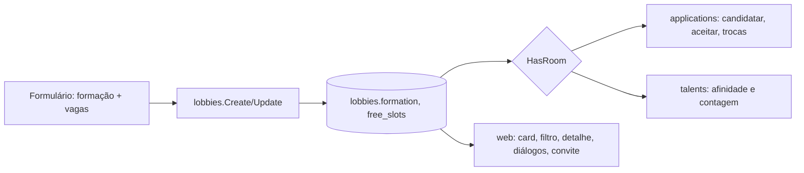

# Design — Grupo livre

- Spec: `./spec.md` · Status: Rascunho

## 1. Visão geral
O lobby ganha a coluna `formation` (`roles` ou `free`) e, no grupo livre, o total de vagas
em `free_slots`. A ocupação do grupo livre é o total de ocupantes: o dono mais os membros
aceitos, de qualquer função. Cada regra que hoje pergunta "tem vaga na função X?" passa a
perguntar "tem vaga para este personagem?". A resposta depende da formação e sai de um
ponto só, em cada camada:
- Go: `lobbies.HasRoom`;
- SQL: a afinidade;
- web: `seats.ts`.

## 2. Análise de reuso
| Existente | Onde | Uso nesta feature |
|---|---|---|
| `Slots`, `checkSlots`, `occupied` | `internal/lobbies` | Ficam para "Por função"; o grupo livre usa `FreeSlots` e o total de `Occupied` |
| `freeSlots(lobby, role)` | `internal/applications` | Vira `room(lobby, role)`: no livre, ignora a função |
| `checkSwap` | `applications/swaps.go` | No livre, só nível e conflito (RN-05) |
| Trava do lobby no aceite | `lockApplication` (FOR UPDATE) | Mesma trava garante a RN-04 nos aceites simultâneos |
| `composition()` e `eligibility()` | `web/src/lib/applications/detail.ts` | Ganham o caso livre; a lista única reaproveita o card de pessoa |
| `RoleComposition` | `web/src/lib/home/components` | Fica para "Por função"; o livre usa um componente novo, `FreeComposition` |
| `openSlotsLabel` | `web/src/lib/lobbies/share.ts` | Ganha o caso livre (RN-12) |
| Afinidade por função | `queries/talents.sql` | O livre manda as três funções quando há vaga (RN-13) |

## 3. Componentes e interfaces

### Backend
- `lobbies.Input` e `lobbies.UpdateInput` ganham `Formation` e `FreeSlots`. `Lobby` ganha os
  dois. Para o grupo livre, `Slots` fica zerado.
- `lobbies.HasRoom(l Lobby, role string) bool`: no livre, `total(Occupied) < FreeSlots`;
  por função, `Slots.of(role) > Occupied.of(role)`. Usado por `talents`.
- Validação na criação e na edição:
  - "Por função": as regras de hoje;
  - livre: `FreeSlots` entre 2 e 12 (`freeSlots/invalid`);
  - edição: `FreeSlots` não abaixo do total de ocupantes (`freeSlots/below_occupied`);
  - troca de formação com membro ou pendente: `formation/locked`.
- `applications`:
  - candidatar e aceitar usam `room(lobby, role)`; no livre, sem vaga é a regra nova
    `group_full`;
  - `checkSwap` pula a vaga quando a formação é livre.
- `talents.ForLobby` e `Count`: no livre, as funções abertas são as três se houver vaga.
  Senão, nenhuma.

### Endpoints / contratos (`openapi.yaml`)
| Mudança | Detalhe | IDs |
|---|---|---|
| `Formation` (novo enum) | `roles`, `free` | RN-01 |
| `LobbyInput`, `LobbyUpdate` | `formation` (opcional, padrão `roles`) e `freeSlots` (obrigatório se `free`) | RN-01, RN-02, RN-06, RN-07 |
| `Lobby` | `formation` e `freeSlots` (nullable); `slots` zerado no livre; `occupied` continua por função (informativo) | RN-03, RN-10 |
| `FieldError` | campos `formation` e `freeSlots`; código `locked` | RN-02, RN-06, RN-07 |
| `ApplicationRuleError` | código `group_full` | RN-04 |
| `GET /talents/count` | parâmetros `formation` e `freeSlots` opcionais; `tank/support/dps` passam a opcionais | RN-13 |

### Web
- `lib/lobbies/seats.ts` (novo): `isFree(lobby)`, `occupiedTotal`, `totalSeats` e
  `hasRoom(lobby, role)`. O card, o filtro, o detalhe, os diálogos e o convite usam essas
  funções.
- Formulário: o fieldset "Formação" com os rádios "Por função" e "Grupo livre". No livre,
  um stepper só, "Vagas", de 2 a 12. A prévia usa o card livre.
- Home: o tipo `Lobby` ganha `formation` e `free: { filled, total }`. `LobbyCard` e
  `FeaturedLobby` mostram o selo, "X de N" e a barra (`FreeComposition`). A borda usa a
  cor neutra `--free-line`. `filters.ts` aceita o livre em qualquer função.
- Detalhe: no livre, a "Composição" é uma lista de N lugares. Os diálogos usam `hasRoom`.
- `share.ts`: "Vagas: N livres" e "1 livre".

## 4. Modelo de dados
| Entidade | Campo | Tipo | Restrições | Garante |
|---|---|---|---|---|
| `lobbies` | `formation` | text | NOT NULL DEFAULT 'roles', CHECK in ('roles','free') | RN-01, RNF-01 |
| | `free_slots` | smallint | NULL; CHECK 2..12 | RN-02 |
| | (CHECK trocado) | — | `roles`: soma das funções 1..12 e `free_slots` nulo; `free`: soma 0 e `free_slots` preenchido | RN-01, RN-02 |

Migração: `00008_lobby_formation.sql`. Ela tira o CHECK antigo da soma e cria o novo. Os
lobbies existentes ficam com `formation = 'roles'`.

## 5. Decisões técnicas (ADR)

### D-01 — Coluna de formação em vez de "vagas de Dano = 12"
- Status: Proposta
- Contexto: daria para fingir o grupo livre com todas as vagas numa função, mas as
  candidaturas de outras funções seriam recusadas. [RN-03]
- Opções: (a) truque nas vagas existentes; (b) `formation` + `free_slots`.
- Decisão: (b).
- Consequências: + regra explícita e testável, lobbies antigos intactos; − todo ponto
  que lê vagas precisa olhar a formação (concentrado em `HasRoom`/`seats.ts`).

### D-02 — `occupied` por função continua no contrato
- Status: Proposta
- Contexto: o detalhe e as estatísticas ainda mostram a função de cada ocupante. [RN-03]
- Decisão: o `occupied` por função continua no contrato e passa a ser informativo no
  livre. O total vem da soma.
- Consequências: + contrato compatível com o web atual; − no livre, `slots` zerado convive
  com `occupied` > 0 (documentado no schema).

### D-03 — `group_full` separado de `role_full`
- Status: Proposta
- Contexto: a mensagem do livre é "Esse grupo não tem mais vaga.", não a da função. [RN-04]
- Decisão: um código novo na `ApplicationRuleError`, com a mensagem no web.

### D-04 — Troca de formação travada por pendente e aceito
- Status: Proposta
- Contexto: RN-07. Quem se candidatou entrou pensando numa formação.
- Decisão: a edição confere, dentro da transação do lobby travado, se não há aceito nem
  pendente. Senão, responde `formation/locked`, com a mensagem "Só dá para trocar a
  formação com o grupo vazio".

## 6. Riscos
| Risco | Impacto | Mitigação |
|---|---|---|
| Um ponto de "vaga por função" esquecido | Grupo livre recusa alguém por função | Mapa completo do research; testes por CA em cada camada (Go, SSR, e2e) |
| Migração do CHECK em banco com dados | Falha ao subir a v1 | O novo CHECK aceita todo lobby existente (soma 1..12, `free_slots` nulo); teste da migração com lobby antigo |
| Aceites simultâneos no livre | Grupo acima do total | Mesma trava do lobby no aceite; teste de concorrência (CA-02.3) |
