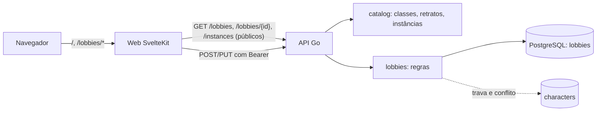

# Design — Lobbies

- Spec: `./spec.md` · Status: Aprovado
- Tela: Claude Design, `Lobby.dc.html` — criação como página com prévia (1b), detalhe
  (1c), cancelamento (1d)

## 1. Visão geral
A API ganha o catálogo de instâncias, a tabela de lobbies e as rotas de listar, ver,
criar, editar e cancelar. O web troca os dados fictícios da Home pela API e ganha as
páginas `/lobbies/novo`, `/lobbies/{id}` e `/lobbies/{id}/editar`. Como no perfil, o
navegador nunca fala com a API direto: o servidor do SvelteKit carrega e grava.

## 2. Análise de reuso
| Existente | Onde | Uso nesta feature |
|---|---|---|
| `catalog` (classes, retratos) | `backend/internal/catalog` | Ganha a lista de instâncias (RN-01) |
| `LockUser` e `inTx` | `backend/internal/characters` | Mesmo padrão de transação com trava no Usuário (D-05) |
| `ValidationError` com campo e código | `backend/internal/characters` | Mesmo formato de erro 422 para o lobby (D-07) |
| `currentUser`, `internalError` | `backend/internal/server` | Sessão nas rotas do dono e 500 sem detalhes |
| Home: tipos, filtros, cards, destaque | `web/src/lib/home` | Continuam; só a fonte dos dados muda (D-09) |
| `TopBar`, `Button`, `Icon`, `Select` | `web/src/lib/home/components`, `web/src/lib/ui` | Barra, botões e selects |
| `ConfirmDialog` do perfil | `web/src/lib/characters/components` | Base do diálogo de cancelar, com o campo de motivo |
| Ponta a ponta com duas contas | `web/test/e2e`, Discord falso | Dono e outro jogador |

## 3. Componentes e interfaces

### Backend
- **`internal/catalog`**: `Instances()`, `InstanceByID(id)`. Cada instância tem `ID`
  (nome sem acento em kebab-case), `Name`, `Level` e `Reset` (`daily`, `three_days`,
  `hours`, `weekly`). Só as de grupo (RN-01).
- **`internal/lobbies`**: serviço com `List(from, to)`, `Get(id)`, `Create`, `Update`,
  `Cancel`. Valida (RN-05 a RN-10, RN-17 a RN-19), roda criação e edição numa transação
  com o Usuário travado (D-05) e devolve `ErrNotFound`, `ErrNotOpen`, `ErrLimitReached` ou
  `ValidationError`.
- **`internal/characters`**: `Delete` e `Update` (quando muda a função) consultam se o
  personagem é dono de um lobby aberto e devolvem `ErrInOpenLobby` (RN-21).
- **`internal/server/lobbies.go`**: as rotas do contrato.

### Endpoints
| Método | Rota | Entrada | Saída | Erros | IDs |
|---|---|---|---|---|---|
| GET | `/instances` | — | 200 `Instance[]` | — | RN-01, RN-02, CA-06.1 |
| GET | `/lobbies` | `from`, `to` (datas YYYY-MM-DD em São Paulo) | 200 `Lobby[]` abertos, por início | 400 | RN-13, RN-14, RN-22 |
| GET | `/lobbies/{id}` | — | 200 `Lobby` (qualquer estado) | 404 | RN-15 |
| POST | `/lobbies` | Bearer, `LobbyInput` | 201 `Lobby` | 401, 409 `lobby_limit`, 422 | RN-04 a RN-12 |
| PUT | `/lobbies/{id}` | Bearer, `LobbyUpdate` | 200 `Lobby` | 401, 404, 409 `lobby_not_open`, 422 | RN-17, RN-18, RN-20 |
| POST | `/lobbies/{id}/cancel` | Bearer, `{reason}` | 200 `Lobby` | 401, 404, 409 `lobby_not_open`, 422 | RN-19, RN-20 |

Schemas novos:
- `Instance`: `{id, name, level, reset}`.
- `Slots`: `{tank, support, dps}`.
- `LobbyInput`: `{instanceId, startsAt, slots, minLevel, characterId, note?}`. O
  `startsAt` vai em UTC (ISO 8601); o web converte o dia e a hora de Brasília.
- `LobbyUpdate`: `{startsAt, slots, minLevel, note?}`.
- `Lobby`:
  - `id`, `instance` e `startsAt`;
  - `status` (`open`, `started` ou `cancelled`), `slots`, `occupied`, `minLevel`, `note`;
  - `owner`: `{userId, discordName, characterId, nick, classId, level, role}`. O
    `characterId` e os dados do personagem ficam nulos se ele foi excluído depois do
    início;
  - `cancelReason`, `createdAt`.
- `Error.error` ganha `lobby_limit`, `lobby_not_open` e `character_in_open_lobby`.
- `FieldError.field` ganha `instanceId`, `startsAt`, `slots`, `minLevel`, `characterId`,
  `note` e `reason`. `FieldError.code` ganha `conflict` (horário) e `too_short` (motivo).

### Web
- **`lib/lobbies/api.ts`**: chamadas do servidor do web, no padrão de
  `lib/characters/api.ts`.
- **`lib/lobbies/time.ts`**: converte dia e hora de Brasília para UTC e o contrário, e
  monta os 14 dias (reusa `lib/home/time.ts`).
- **`lib/lobbies/toHome.ts`**: transforma o `Lobby` da API no `Lobby` da Home (data e hora
  em São Paulo, anfitrião, classe, composição).
- **`LobbyForm.svelte`**: formulário da criação e da edição. Tem:
  - select de instância com dois `optgroup` ("Nível 130 ou mais" e "Nível menor");
  - select de dia (14 dias) e campo de hora;
  - contadores de vagas por função;
  - nível mínimo, observação e personagem (rádios em cartões).

  A prévia do card ao lado (1b) reusa o `LobbyCard` da Home com os valores do formulário.
- **`routes/lobbies/novo`**: exige login. Carrega instâncias e personagens. Sem
  personagens, mostra o aviso com link para `/perfil` (RN-12). A action `create`
  redireciona para o detalhe.
- **`routes/lobbies/[id]`**: público. O dono vê "Editar" e "Cancelar lobby". A action
  `cancel` usa um diálogo com o campo de motivo.
- **`routes/lobbies/[id]/editar`**: só o dono, só aberto. Usa o mesmo `LobbyForm`, sem a
  instância e o personagem.
- **Home**: o `load` busca `GET /lobbies` dos 14 dias. "Criar lobby" vira link para
  `/lobbies/novo` e "Ver grupo" vira link para o detalhe. "Candidatar" continua "em
  breve".
- **Perfil**: o erro `character_in_open_lobby` vira a mensagem da RN-21.

## 4. Modelo de dados
Migração `00004_lobbies.sql`:

| Campo | Tipo | Restrições | Garante |
|---|---|---|---|
| id | uuid | PK | — |
| owner_id | uuid | FK `users` `ON DELETE CASCADE`, índice | RN-04 |
| instance_id | text | não vazio (catálogo em Go) | RN-01 |
| instance_name, instance_level | text, smallint | cópia do catálogo na criação | borda "instância sai do catálogo" |
| starts_at | timestamptz | índice | RN-05, RN-13 |
| slots_tank, slots_support, slots_dps | smallint | `0..12`, soma `1..12` | RN-06 |
| min_level | smallint | `1..275` | RN-07 |
| owner_character_id | uuid null | FK `characters` `ON DELETE SET NULL`, índice | RN-08, RN-10 |
| owner_role | text | `tank/support/dps` | P-02 (vaga ocupada) |
| note | text null | `<= 250` | RN-09 |
| cancelled_at, cancel_reason | timestamptz null, text null | os dois juntos; motivo `10..250` | RN-19 |
| created_at | timestamptz | — | — |

O estado não fica numa coluna: é *cancelado* quando `cancelled_at` existe, *iniciado*
quando `starts_at <= agora`, *aberto* nos outros casos (RN-13).

## 5. Decisões técnicas (ADR)

### D-01 — O dono fica no próprio lobby, sem tabela de membros por enquanto
- Status: Proposta
- Contexto: só o dono ocupa vaga nesta feature (P-02). A candidatura vai trazer os
  membros. [RN-08, RN-15]
- Opções: (a) tabela `lobby_members` já agora; (b) `owner_character_id` e `owner_role` no
  lobby.
- Decisão: (b). Ocupantes da função = 1 se for a função do dono. A candidatura soma os
  aceitos depois.
- Consequências: + menos tabelas e regras agora; − a candidatura vai mexer na contagem de
  ocupantes (um ponto só, `occupied`).

### D-02 — Cópia do nome e do nível da instância
- Status: Proposta
- Contexto: o catálogo vive em Go e pode mudar; um lobby aberto não pode perder o nome
  (borda da spec). [RN-01]
- Decisão: gravar `instance_id`, `instance_name` e `instance_level` na criação.

### D-03 — Conflito de horário por janela fixa de 2 h
- Status: Proposta
- Contexto: RN-10; sem duração.
- Decisão: dois lobbies conflitam quando `|início A − início B| < 2 h`. A consulta procura
  outro lobby não cancelado com o mesmo `owner_character_id` e início em
  `(início − 2 h, início + 2 h)`. A candidatura vai repetir a mesma consulta para os
  membros aceitos.
- Consequências: + regra simples e testável; − lobbies de instâncias longas não estendem
  a janela.

### D-04 — Horário de Brasília na borda, UTC no resto
- Status: Proposta
- Contexto: RN-05 e RN-09 da `home-local`.
- Decisão:
  - o web converte dia e hora de `America/Sao_Paulo` para UTC antes de enviar;
  - a API confere que o dia em São Paulo cai entre hoje e hoje + 13;
  - a API usa `time.LoadLocation` com `time/tzdata` embutido, porque a imagem
    distroless não tem a base de fusos;
  - a listagem recebe `from` e `to` como datas de São Paulo.

### D-05 — Transação com trava no Usuário
- Status: Proposta
- Contexto: limite de 5 e conflito precisam valer com pedidos simultâneos (CA-06.5).
- Decisão: criar e editar travam o Usuário (`LockUser`), contam os lobbies abertos e
  procuram conflito dentro da mesma transação. Excluir personagem e mudar a função também
  travam o Usuário antes de checar a RN-21, para não correr contra uma criação.

### D-06 — Rotas de leitura públicas, de escrita com sessão
- Status: Proposta
- Contexto: RN-15 e RN-22; a Home e o detalhe são públicos.
- Decisão: `GET /lobbies`, `GET /lobbies/{id}` e `GET /instances` sem sessão. O `Lobby`
  traz `owner.userId`, e o web compara com o usuário da sessão para mostrar as ações do
  dono. O nome do Discord do dono aparece no detalhe, para os jogadores combinarem.

### D-07 — Erros por campo, mensagens no web
- Status: Proposta
- Decisão: mesmo formato da `personagens`. Mensagens novas:
  - `startsAt/invalid` → "Escolha um horário no futuro, em até 14 dias";
  - `startsAt/conflict` → "Esse personagem já está num grupo nesse horário";
  - `slots/invalid` → "De 1 a 12 vagas, com pelo menos 1 na função do seu personagem";
  - `slots/below_occupied` → "Essa função já tem ocupante";
  - `minLevel/invalid` → "Entre o nível da instância e 275";
  - `minLevel/above_owner` → "Seu personagem precisa ter o nível mínimo";
  - `characterId/invalid` → "Escolha um dos seus personagens";
  - `note/too_long` → "Use até 250 caracteres";
  - `reason/too_short` → "Escreva de 10 a 250 caracteres";
  - `lobby_limit` → "Você já tem 5 lobbies abertos".

### D-08 — Edição e cancelamento de lobby iniciado respondem 409
- Status: Proposta
- Contexto: CA-04.4 e borda "lobby começa durante a edição".
- Decisão: lobby de outro Usuário → 404 (RN-20); do dono, mas iniciado ou cancelado →
  409 `lobby_not_open`.

### D-09 — Home troca a fonte, não os componentes
- Status: Proposta
- Contexto: RN-22 e RN-08 da `home-local`.
- Decisão: o `load` da Home busca `GET /lobbies` e converte para o tipo `Lobby` que os
  componentes já usam. Os dados fictícios saem da Home e ficam só nos testes.
- Consequências: + filtros, destaque e testes de tela continuam valendo; − a Home precisa
  da API no ar. Sem API, mostra o aviso de falha (RN-21 da `personagens`) e a lista vazia.

## 6. Riscos
| Risco | Impacto | Mitigação |
|---|---|---|
| Fuso errado na conversão | Lobby no dia ou hora errados | Testes nos dois lados com a virada do dia (23:30 em São Paulo) |
| Imagem sem base de fusos | API não sobe na pilha `app` | `time/tzdata` embutido e o smoke da pilha `app` na CI |
| Corrida no limite ou no conflito | 6 lobbies ou personagem em dois grupos | Trava no Usuário (D-05) e teste de concorrência |
| E2E dependente do relógio | Testes que falham perto da meia-noite | Lobbies do ponta a ponta sempre para amanhã às 20:00 |
