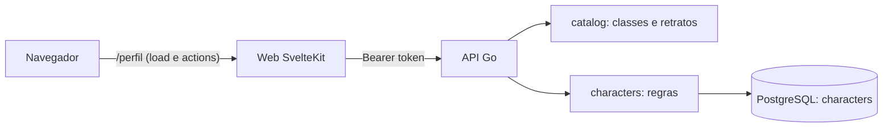

# Design — Perfil e personagens

- Spec: `./spec.md` · Status: Aprovado
- Tela: Claude Design, `Perfil.dc.html` (projeto "RO Lobby Home v2"): carta vertical 1b,
  com a página em 2a, o cadastro em 1e e a exclusão e o perfil vazio em 1f

## 1. Visão geral
A API ganha um catálogo (classes e retratos) e as rotas de personagem, todas atrás da
sessão do login (ADR-07). O web ganha a rota `/perfil`, que carrega os personagens e o
catálogo pelo servidor do SvelteKit e grava pelas *form actions*. O navegador nunca fala
com a API direto, como já acontece no login.

## 2. Análise de reuso
| Existente | Onde | Uso nesta feature |
|---|---|---|
| Sessão e `Authenticate` | `backend/internal/auth` | Descobrir o Usuário em toda rota de personagem (RN-01) |
| `withSessionToken` | `backend/internal/server/auth.go` | Já põe o token no contexto; as rotas novas só leem |
| Strict server gerado | `backend/internal/api` | As rotas novas entram no `openapi.yaml` e no mesmo `handlers` |
| `testdb` | `backend/internal/testdb` | Banco descartável nos testes de integração das regras |
| Lista de classes do bROWiki | `web/src/lib/catalog/classes.ts` | Vira a base do catálogo em Go; no web fica só para os ícones e a Home fictícia (D-03) |
| `locals.user` e login com `next` | `web/src/hooks.server.ts`, `routes/auth` | `/perfil` redireciona o visitante para `/auth/discord/login?next=/perfil` (RN-03) |
| `UserMenu` (padrão de menu por teclado), `Button`, `IconButton`, `Badge`, `Select`, `Icon` | `web/src/lib/home/components`, `web/src/lib/ui` | Menu "Meu perfil", carteirinha, formulário |
| Tokens do design system | `web/src/lib/ui/tokens` | Cores da função, âmbar do principal |
| Discord falso no ponta a ponta | `web/playwright.config.ts` | Login dos testes de perfil, com dois usuários (D-11) |

Não reuso o `Drawer` para o formulário: o desenho pede um diálogo central, e o `<dialog>`
nativo já dá foco preso e `Esc` (RNF-01).

## 3. Componentes e interfaces

### Backend
- **`internal/catalog`**: lista fixa das 82 classes (id, nome, plural, nível da classe,
  linha) e dos 4 retratos (id). Funções `Classes()`, `ClassByID(id)` e `HasPortrait(id)`.
  [RN-06, RN-10, RN-20]
- **`internal/characters`**: serviço com `List`, `Create`, `Update`, `Delete` e `SetMain`,
  todos recebendo o id do Usuário. Faz a validação dos campos (RN-04 a RN-10) e roda as
  regras de limite e de principal numa transação (D-06). Erros: `ErrNotFound`,
  `ErrLimitReached` e `ValidationError` (lista de campo e código).
- **`internal/server/characters.go`**: as rotas do contrato. Autentica, chama o serviço e
  traduz os erros para 401, 404, 409 e 422.

### Endpoints
| Método | Rota | Entrada | Saída | Erros | IDs |
|---|---|---|---|---|---|
| GET | `/classes` | — | 200 `Class[]` | — | RN-20, CA-07.1 |
| GET | `/characters` | Bearer | 200 `Character[]`, principal primeiro | 401 | RN-01, RN-17, CA-01.1, CA-01.3 |
| POST | `/characters` | Bearer, `CharacterInput` | 201 `Character` | 401, 409 `character_limit`, 422 | RN-04 a RN-12, CA-02.* |
| PUT | `/characters/{id}` | Bearer, `CharacterInput` | 200 `Character` | 401, 404, 422 | RN-02, RN-15, CA-03.* |
| DELETE | `/characters/{id}` | Bearer | 204 | 401, 404 | RN-02, RN-14, CA-04.* |
| PUT | `/characters/{id}/main` | Bearer | 204 | 401, 404 | RN-13, CA-05.1 |

Schemas novos:
- `Class`: `{id, name, plural, tier, family}`.
- `Role`: enum `tank | support | dps`.
- `Portrait`: enum `retrato-1 | retrato-2 | retrato-3 | retrato-4` (D-04).
- `CharacterInput`: `{nick, classId, level, role, portrait?, link?}`.
- `Character`: `CharacterInput` mais `id`, `isMain` e `createdAt`.
- `ValidationError`: `{error: "validation", fields: [{field, code}]}`. Os campos são
  `nick`, `classId`, `level`, `role`, `portrait` e `link`. Os códigos são `required`,
  `too_long`, `invalid` e `taken` (D-07).
- `Error.error` ganha `not_found` e `character_limit`.

### Web
- **`lib/characters/api.ts`**: chamadas do servidor do web à API (listar, criar, editar,
  excluir, principal, classes), no padrão de `lib/auth/api.ts`.
- **`lib/characters/messages.ts`**: código de erro → mensagem em pt-BR (RN-19).
- **`lib/characters/portraits.ts`**: id do retrato → arquivo em `static/portraits/`.
- **`CharacterCard.svelte`**: carta vertical 1b, com retrato grande, nick, selo
  "Principal", classe, nível em destaque e função na cor da função. Embaixo ficam o botão
  do link (`target="_blank"`, `rel="noopener noreferrer"`) e o botão "…" (RN-16, RN-09).
- **`CardMenu.svelte`**: o menu "…" (`aria-haspopup="menu"`, itens `menuitem`), com
  "Tornar principal" (fora do principal), "Editar" e "Excluir". Abre por teclado, `Esc`
  fecha e devolve o foco ao botão, no mesmo padrão do `UserMenu` (RNF-01).
- **`CharacterDialog.svelte`**: cadastro e edição no `<dialog>`, com seletor de retrato
  (rádios), nick, classe (select do catálogo), nível, função e link. Mostra os erros junto
  do campo (RN-19).
- **`ConfirmDialog.svelte`**: confirmação de exclusão (RN-15).
- **`routes/perfil/+page.server.ts`**: o `load` exige `locals.user` e busca personagens e
  classes. As actions `create`, `update`, `delete` e `main` chamam a API. Num 401, apagam
  o cookie e mandam ao login (borda "sessão vencida").
- **`UserMenu.svelte`**: item "Meu perfil" acima de "Sair" (RN-18).

## 4. Modelo de dados
Migração `00003_characters.sql`:

| Entidade | Campo | Tipo | Restrições | Garante |
|---|---|---|---|---|
| characters | id | uuid | PK, `gen_random_uuid()` | — |
| | user_id | uuid | FK `users(id)` `ON DELETE CASCADE`, índice | RN-01 |
| | nick | text | `char_length` 1–24, sem espaço nas pontas | RN-04 |
| | class_id | text | não vazio (validado no catálogo, sem FK; D-03) | RN-06 |
| | level | smallint | `CHECK 1..275` | RN-07 |
| | role | text | `CHECK IN ('tank','support','dps')` | RN-08 |
| | portrait | text | não vazio (validado no catálogo) | RN-10 |
| | link | text null | `char_length <= 300`, começa com `https://` | RN-09 |
| | is_main | boolean | índice único parcial `(user_id) WHERE is_main` | RN-12 |
| | created_at | timestamptz | não nulo | RN-14, RN-17 |

Índice único `characters_nick_key ON characters (lower(nick))` para RN-05 e CA-07.3.

Os `CHECK` do banco repetem as regras do serviço como última defesa. Quem dá a mensagem ao
usuário é o serviço.

## 5. Decisões técnicas (ADR)

### D-01 — Rotas REST com o principal numa rota própria
- Status: Proposta
- Contexto: trocar o principal mexe em dois personagens. [RN-13]
- Opções: (a) campo `isMain` no `PUT /characters/{id}`; (b) `PUT /characters/{id}/main`.
- Decisão: (b). O `CharacterInput` fica só com os dados do personagem.
- Consequências: + edição e principal não se misturam; − uma rota a mais.

### D-02 — Nick único por índice em `lower(nick)`
- Status: Proposta
- Contexto: o nick é único sem diferenciar maiúsculas, mas "Faísca" e "Faisca" são
  diferentes. Pedidos simultâneos não podem passar. [RN-05, CA-07.3]
- Opções: (a) conferir antes de gravar; (b) índice único em `lower(nick)`; (c) `citext`.
- Decisão: (b). O serviço traduz a violação (`23505` nesse índice) para o campo `nick`
  com o código `taken`.
- Consequências: + o banco garante a regra mesmo com corrida; + sem extensão nova;
  − `lower` depende da collation do banco para letras acentuadas. Um teste com "FAÍSCA" e
  "faísca" cobre isso.

### D-03 — Catálogo de classes em Go, guardado no personagem pelo id
- Status: Proposta
- Contexto: RN-20 pede a API como fonte única, e uma classe que sair do catálogo não
  pode quebrar os personagens já salvos.
- Opções: (a) tabela `classes` com FK; (b) lista fixa em Go, com `class_id` em texto;
  (c) manter no web.
- Decisão: (b). O id é o nome sem acento em kebab-case (`guardiao-real`). `GET /classes`
  serve a lista, e o formulário do web usa só ela. No web, `classes.ts` continua só com o
  ícone por linha e os dados da Home fictícia, que sai quando os lobbies forem reais. Um
  teste do web confere que toda linha (`family`) da API tem ícone, com ícone padrão se
  faltar.
- Consequências: + mudar o catálogo não pede migração; + personagem salvo sobrevive a uma
  classe removida; − o catálogo do Go e a Home fictícia têm a mesma lista por um tempo.

### D-04 — Retratos como enum no contrato e arquivos no web
- Status: Proposta
- Contexto: são 4 retratos de exemplo e a lista definitiva vem depois. Precisam ser arte
  original e servidos pelo web. [RN-10, RNF-02]
- Opções: (a) enum no `openapi.yaml`; (b) rota `GET /portraits`.
- Decisão: (a). O enum gera o tipo no Go e no TypeScript, e um teste do web confere que
  todo retrato do enum tem arquivo em `static/portraits/`. Os 4 retratos são SVGs
  abstratos feitos para o projeto: fundo em gradiente com um emblema geométrico.
- Consequências: + uma fonte só, com o tipo checado nos dois lados; − trocar a lista mexe
  no contrato, o que é aceitável quando a lista definitiva chegar.

### D-05 — Formulários pelas *form actions* do SvelteKit
- Status: Proposta
- Contexto: o token de sessão fica num cookie HttpOnly que só o servidor do web lê
  (ADR-07). Os erros precisam voltar sem perder o que foi digitado. [RN-19]
- Opções: (a) form actions com `use:enhance`; (b) rotas `+server.ts` chamadas por `fetch`.
- Decisão: (a). Num erro, a action devolve `fail(422, {values, errors})` e o diálogo
  reabre com os valores e as mensagens.
- Consequências: + funciona sem JavaScript; + o token nunca chega ao navegador;
  − o diálogo precisa reabrir a partir do `form` devolvido.

### D-06 — Limite e principal numa transação com trava no Usuário
- Status: Proposta
- Contexto: dois cadastros simultâneos poderiam passar de 10 personagens ou criar dois
  principais. [RN-11, RN-12, RN-14]
- Opções: (a) contar e gravar sem trava; (b) `SELECT ... FROM users WHERE id = $1
  FOR UPDATE` no início de criar, excluir e trocar o principal.
- Decisão: (b). Na criação, o primeiro personagem nasce principal. Na exclusão do
  principal, o mais antigo que sobrar vira principal. Na troca, desmarca todos e marca o
  novo. O índice único parcial do item 4 é a última defesa.
- Consequências: + regras certas sob corrida, com teste de concorrência; − operações do
  mesmo Usuário ficam em fila, o que não pesa com no máximo 10 personagens.

### D-07 — Erros de campo por código, mensagens no web
- Status: Proposta
- Contexto: a API valida e o web mostra em pt-BR. [RN-19, RNF-04]
- Decisão: a API devolve `{field, code}` e o web traduz:
  - `nick/taken` → "Esse nick já está em uso";
  - `nick/required` → "Informe o nick";
  - `nick/too_long` → "Use até 24 caracteres";
  - `classId/invalid` → "Escolha uma classe da lista";
  - `level/invalid` → "O nível vai de 1 a 275";
  - `link/invalid` → "Use um link https:// válido";
  - `character_limit` → "Você já tem 10 personagens".
- Consequências: + a API não carrega texto de tela; − novos códigos pedem mensagem no web.

### D-08 — Personagem de outro Usuário é 404
- Status: Proposta
- Contexto: RN-02.
- Decisão: as consultas de editar, excluir e principal filtram por `id` e por `user_id`.
  Sem linha, o resultado é `ErrNotFound`, sem consulta à parte para saber se existe.
- Consequências: + não há como sondar ids de outros Usuários.

### D-09 — Validação do link
- Status: Proposta
- Contexto: RN-09 e CA-02.7 (`http://`, `javascript:`).
- Decisão: aceitar só se `url.Parse` der esquema `https`, host não vazio, sem
  usuário/senha na URL e até 300 caracteres. O valor vazio vira nulo.

### D-10 — Retratos e diálogos sem nada de fora
- Status: Proposta
- Contexto: RNF-02.
- Decisão: retratos em `static/portraits/*.svg`; diálogo e carteirinha só com o que já
  existe no web (fontes locais e ícones Lucide). O teste ponta a ponta de origem da Home
  passa a valer também para `/perfil`.

### D-11 — Dois usuários no ponta a ponta
- Status: Proposta
- Contexto: CA-01.3 e CA-02.3 precisam de dois Usuários. O Discord falso hoje devolve
  sempre "grimbold".
- Opções: (a) o falso aceita escolher o usuário na tela de autorização; (b) testar só na
  integração.
- Decisão: (a). A página do falso ganha um campo opcional de usuário (padrão "grimbold").
  As regras entre usuários também têm teste de integração na API.
- Consequências: + o ponta a ponta prova o nick único entre contas; − mexe no falso, que
  é só de teste.

## 6. Riscos
| Risco | Impacto | Mitigação |
|---|---|---|
| `lower()` com acento depender da collation | Nick "FAÍSCA" passar ao lado de "faísca" | Teste de integração específico; o banco do Compose usa UTF-8 |
| O catálogo do Go divergir da lista do web | Ícone errado na carteirinha | Ícone por linha com padrão (D-03) e teste de cobertura |
| Corrida no limite ou no principal | 11 personagens ou dois principais | Trava no Usuário (D-06) e índice parcial; teste com chamadas simultâneas |
| E2E deixar personagens no banco de dev | Nick "em uso" em execuções seguintes | Nicks do e2e com sufixo aleatório e limpeza por usuário no início do teste |
